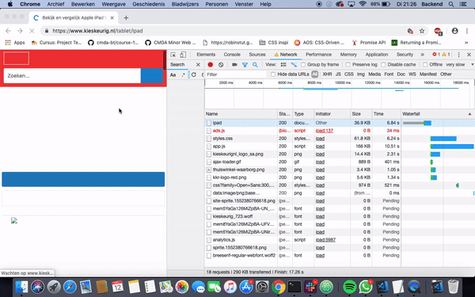

# Browser Technologies
## Opdracht 1.1 - Breek het web

### Criteria
Je krijgt 2 features van de 8
- Zoek uit welke problemen ze kunnen veroorzaken (verzamel cijfers, meningen, ervaringen)
- Zoek uit hoe je dit kunt testen (hoe kun je een feature ‘uitzetten’)
- Vind een aantal sites waar dit ook problemen oplevert (uit je directe omgeving)
- Beschrijf hoe je dit kan fiksen
- Maak hierover een presentatie en neem die woensdag mee, dan gaan we de resultaten bespreken

## Breedband
Als we praten over breedband, hebben we het over de verbinding met het netwerk. De snelheid van deze verbinding wordt uitgedrukt met downloadsnelheid - en uploadsnelheid kbit's.

Gebruikte bronnen:

* Bron: [Pingdom](https://royal.pingdom.com/page-load-time-really-affect-bounce-rate/)
* Bron: [BBC](http://www.bbc.com/future/story/20170619-the-surprising-economic-downsides-of-slow-internet)
* Bron: [Everything You Need to Know About 5G](https://www.youtube.com/watch?v=GEx_d0SjvS0)

#### Welke problemen zijn er met breedband?

Vertraging in functionalitijd

Hogere Bounce Rates

test

#### Hoe kun je Breedband testen?

#### Voorbeelden uit directe omgeving

#### Hoe lost je problemen met Breedband op?
* Bounce rate
*
