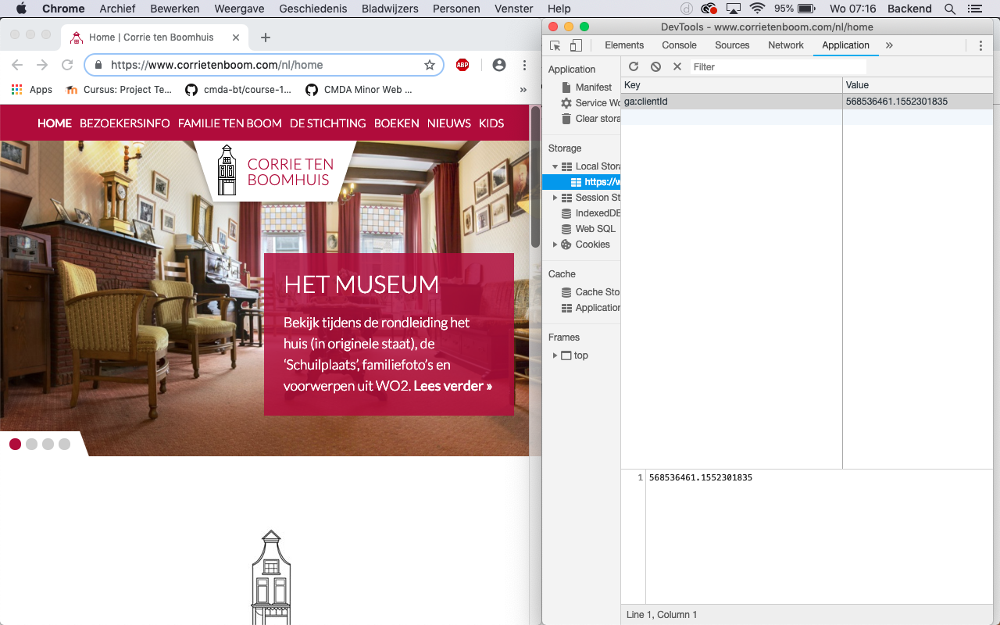

# Browser Technologies
## Opdracht 1.1 - Breek het web

### Criteria
Je krijgt 2 features van de 8
- Zoek uit welke problemen ze kunnen veroorzaken (verzamel cijfers, meningen, ervaringen)
- Zoek uit hoe je dit kunt testen (hoe kun je een feature ‘uitzetten’)
- Vind een aantal sites waar dit ook problemen oplevert (uit je directe omgeving)
- Beschrijf hoe je dit kan fiksen
- Maak hierover een presentatie en neem die woensdag mee, dan gaan we de resultaten bespreken

## Breedband
Als we praten over breedband, hebben we het over de verbinding met het netwerk. De snelheid van deze verbinding wordt uitgedrukt met downloadsnelheid - en uploadsnelheid kbit's.

Gebruikte bronnen:

* Bron: [Pingdom](https://royal.pingdom.com/page-load-time-really-affect-bounce-rate/)
* Bron: [BBC](http://www.bbc.com/future/story/20170619-the-surprising-economic-downsides-of-slow-internet)
* Bron: [Everything You Need to Know About 5G](https://www.youtube.com/watch?v=GEx_d0SjvS0)

#### Welke problemen zijn er met breedband?

Vertraging in functionalitijd

* Een voorbeeld waar de website kieskeurig.nl bezocht wordt

Hogere Bounce Rates

Wanneer een website langer de tijd nodig heeft om te laden, zijn er diverse gebruikers die hier op afhaken. Een gebruiker die een enkele pagina bezoekt en niet verder kijkt, "Bounced" van de pagina af. Hoe lager de Bounce percentage, des te meer pagina's er van je worden bezocht.(Behalve bij een defect)

#### Hoe kun je Breedband testen?

* Devtools in Chrome > Network > offline online ^ Slow
* Devtools in Firefox > Network > beperkingen ^ Slow
* [Rural Broadband Simulator](https://chrome.google.com/webstore/detail/rural-broadband-simulator/dinlajfddccafgpcjeialjbgdohihedo?hl=nl)

#### Voorbeelden uit directe omgeving

#### Hoe los je problemen met Breedband op?

Zorg ervoor dat de basis structuur en opmaak als eerst gerenderd wordt. Maak gebruik van afbeeldingen die geminimaliseerd zijn qua grootte, maar wel voldoende bruikbaar zijn.

---------

## LocalStorage
Als we praten over breedband, hebben we het over de verbinding met het netwerk. De snelheid van deze verbinding wordt uitgedrukt met downloadsnelheid - en uploadsnelheid kbit's.

Gebruikte bronnen:

* Bron: [DevTo](https://dev.to/rdegges/please-stop-using-local-storage-1i04)

#### Welke problemen zijn er met LocalStorage?

Veiligheid

Elk script dat in de html geladen wordt, zou in theorie de localStorage kunnen uitlezen. Stel dat een script als bootstrap, jQuery of Google Analytics gehacked worden, zou het mogelijk zijn om de data uit localStorage naar een API te zenden. LocalStorage heeft geen bescherming.

#### Hoe kun je LocalStorage bekijken?

* Devtools in Chrome > Application > Local Storage ^ <websiteNaam>

#### Voorbeelden uit directe omgeving

Het Corrieboom museum slaat het Google Analytics Id op in de localStorage

Restaurantketen The Fork Trackt al jouw handelingen in de LocalStorage

Een voorbeeld van de opgeslagen gegevens van The Fork

Een voorbeeld van de opgeslagen gegevens van The Fork

#### Hoe los je problemen met Breedband op?

Instellingen > Geavanceerd > Instellingen voor content > Cookies > “Lokale gegevens alleen bewaren totdat je je browser sluit”

Andere browser gebruiken:
• Opera mini
• Opera 10.1
• Safari 3.1 - 3.2
• IE 6 - 7
