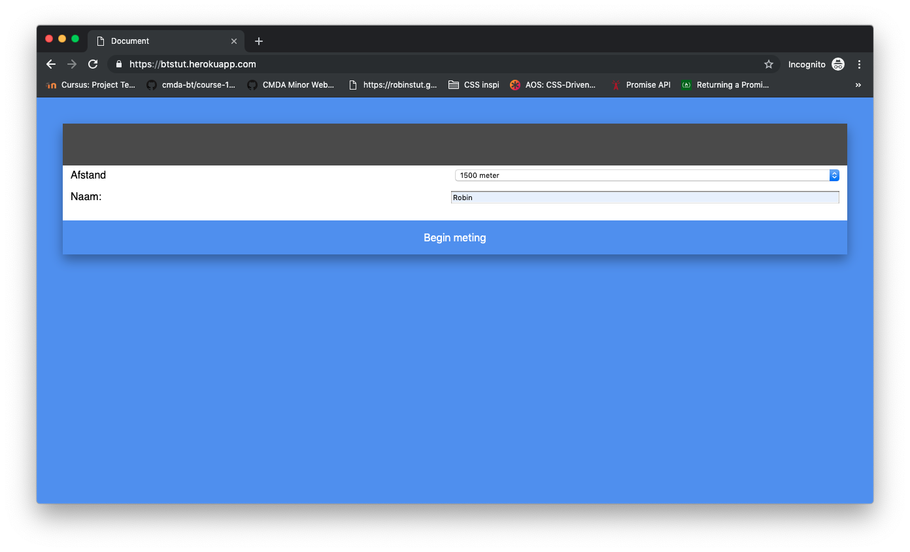
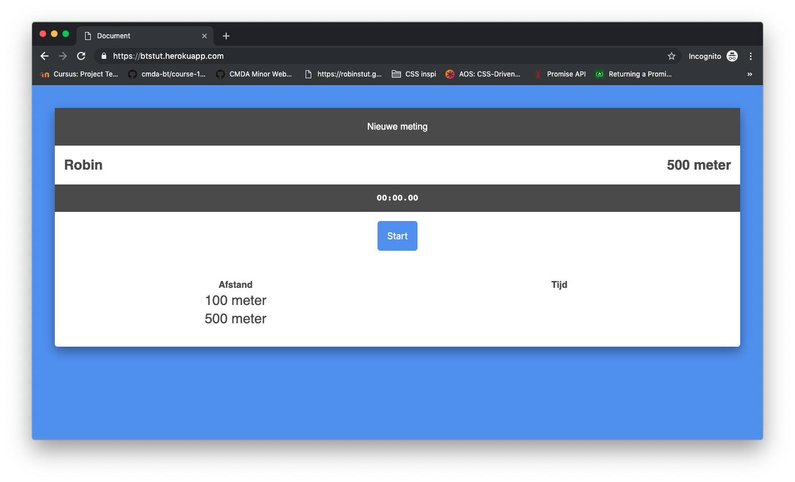
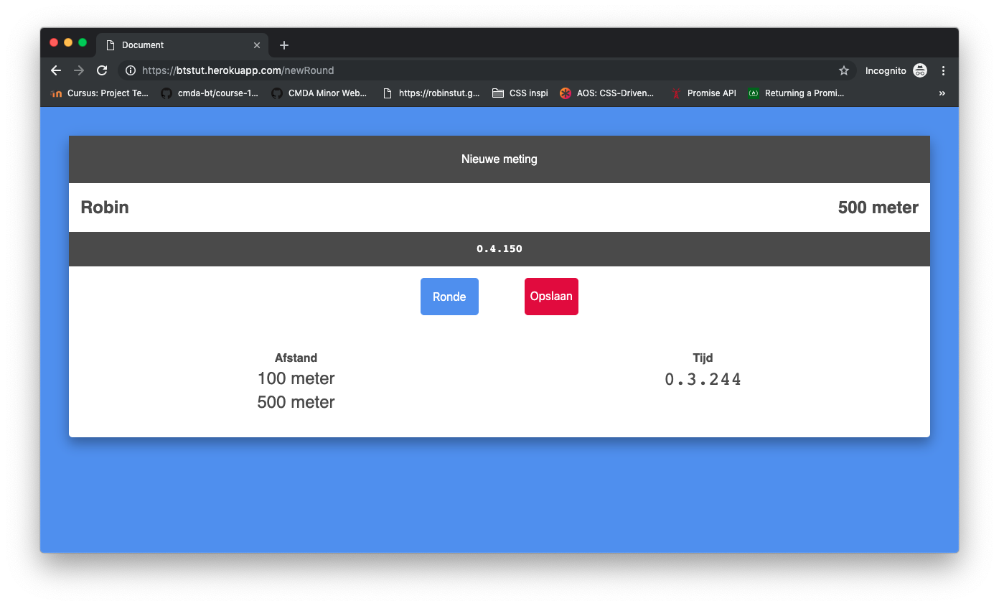
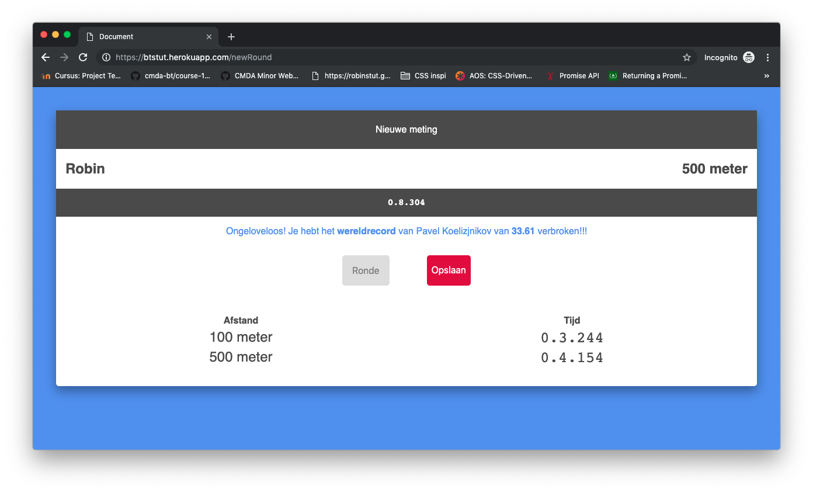

# Browser Technologies @cmda-minor-web 1819

## Use case

> Ik wil de scores van een sportwedstrijd kunnen bijhouden tijdens de wedstrijd.

[Coach app](http://btstut.herokuapp.com/)

## Toegankelijkheid

### Kleur & contrast

Bij het checken van de kleurcontrast op [checkmycolours](http://www.checkmycolours.com/) was het resultaat goed. Er was een issue zodra er zwarte tekst op de blauwe kleur te zien is. Echter heb ik geen zwarte tekst op een blauwe achtergrond en hoef ik hier geen rekening mee te houden.

### Muis

De Coach app is volledig te gebruiken zonder muis. Wanneer er getapt wordt komt de gebruiker door elke form heen, en staan de meest voordehands liggende opties worden als eerst getoond.

### Geen javascript

Doordat de app volledig server side werkt, is er geen javascript nodig voor de functionaliteit van de app

##Feature detection

De html die ik geschreven heb, heb ik laten checken met behulp van [doiuse](http://doiuse.herokuapp.com)
In de html is er geen fout gevonden tijdens de checks

Bij de css heb ik ook de checks uitgevoerd met behulp van [doiuse](http://doiuse.herokuapp.com).

- Wanneer er de melding van staat van het gebruik van REM of EM units, heb ik de pixel variant als fallback in de css geschreven.
- De border-box heb ik geen fallback gegeven, dit omdat de shadow niet crusiaal is voor de functionaliteit.

