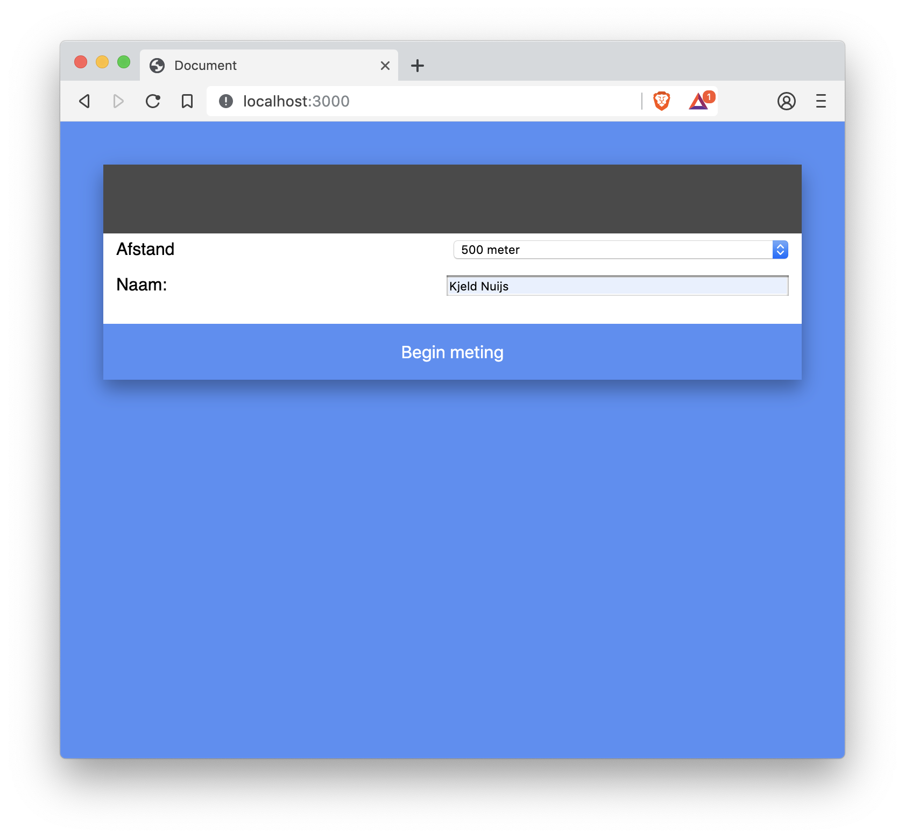
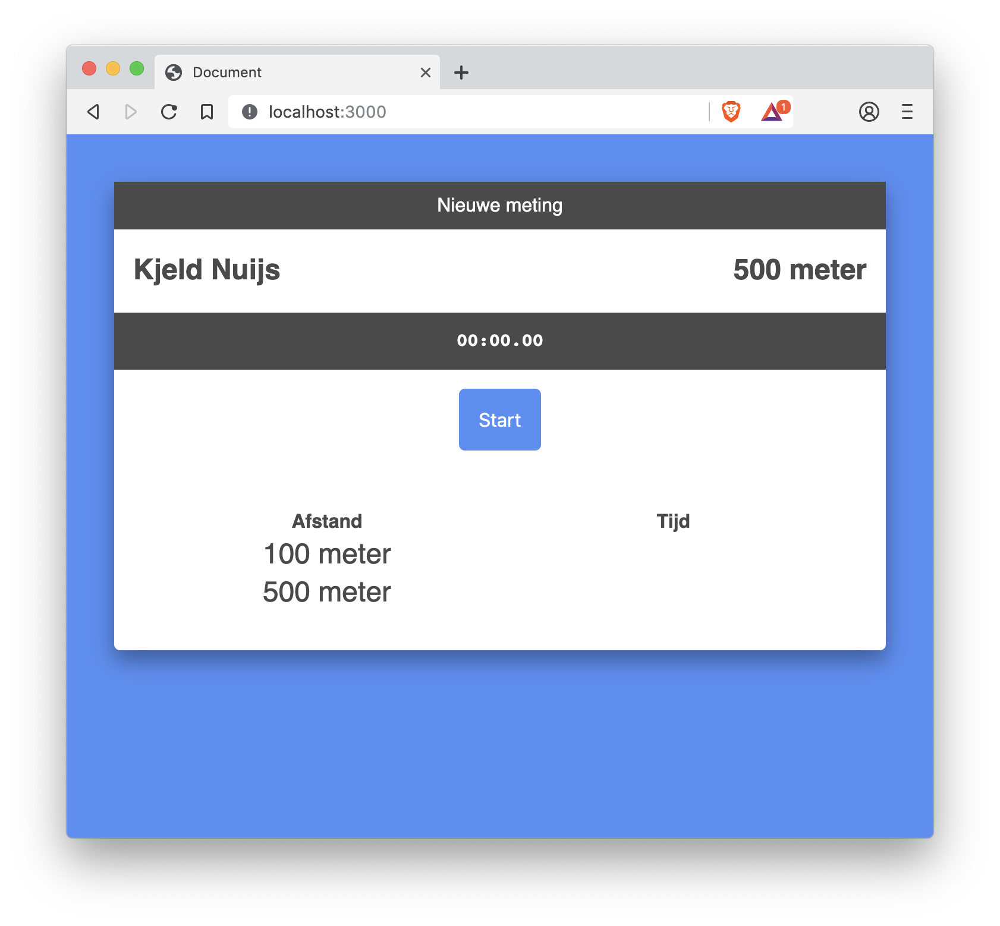
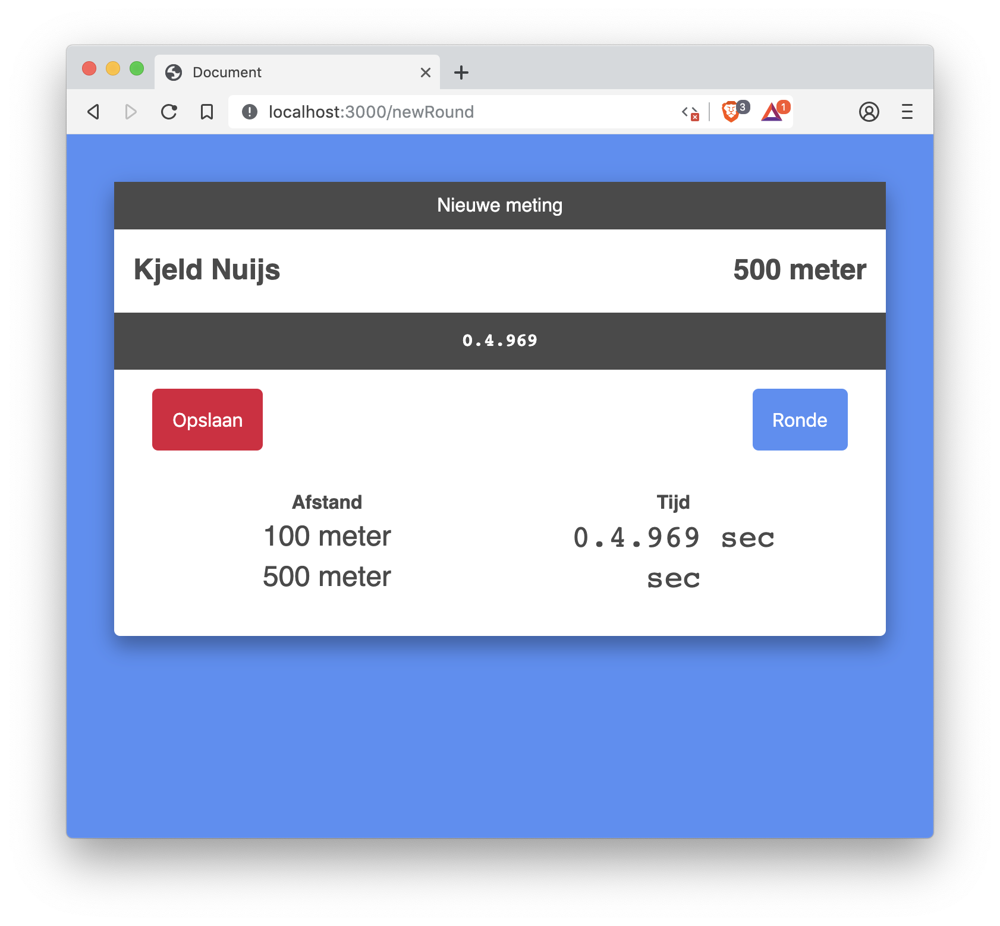
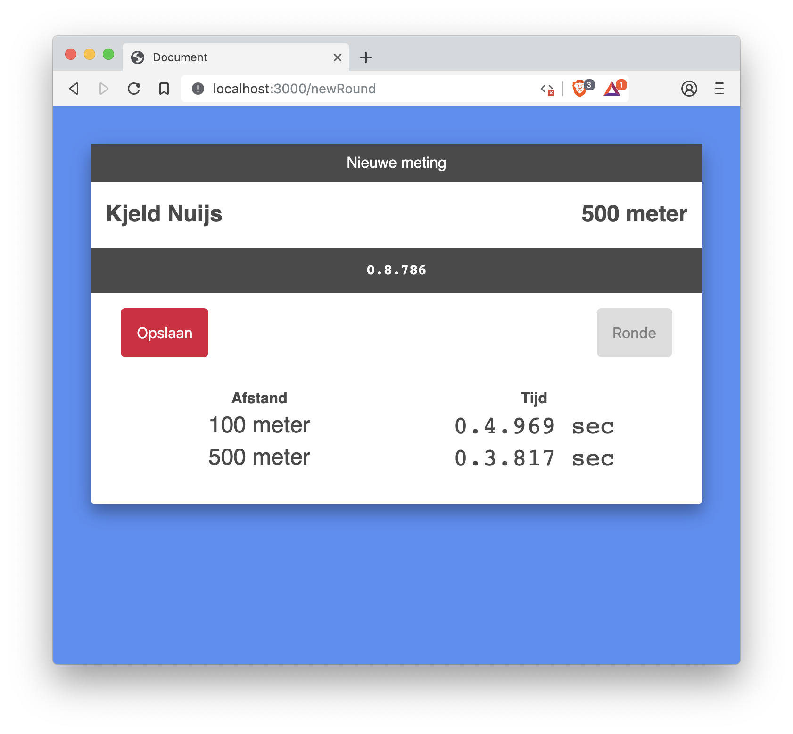
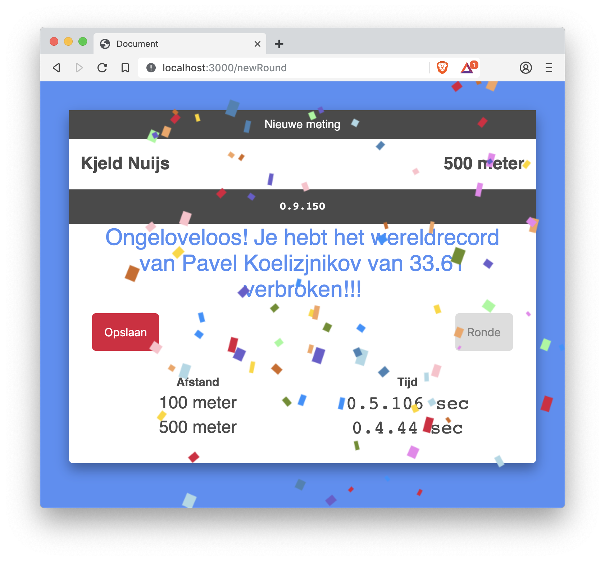
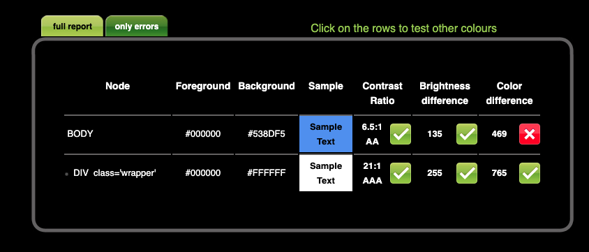
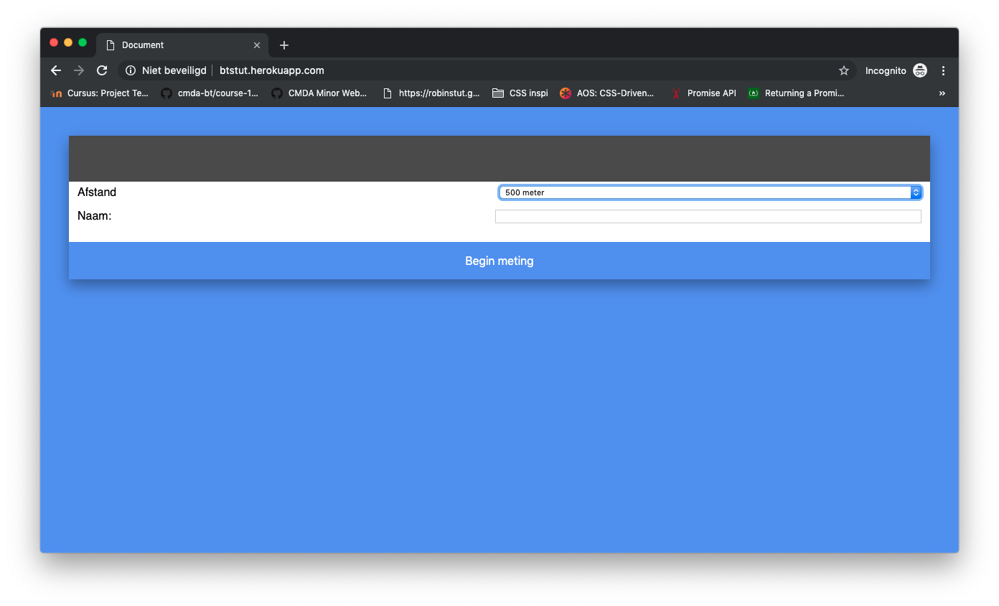
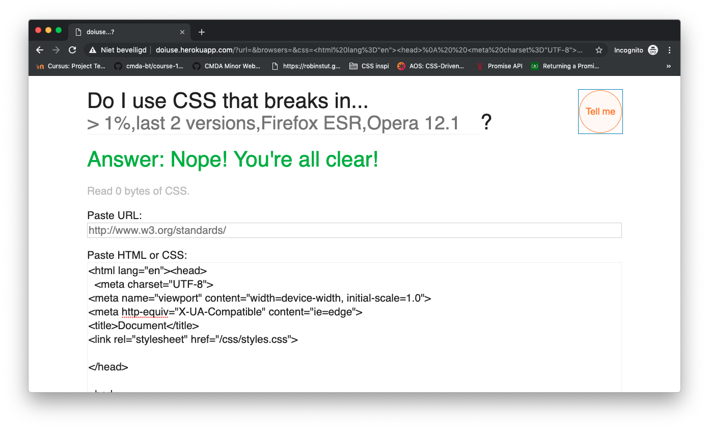
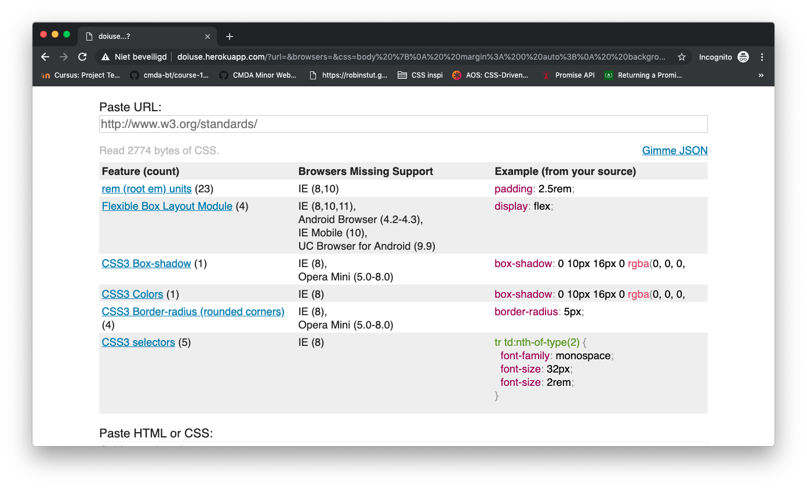

# Browser Technologies @cmda-minor-web 1819

## Inhoud
* [Use case](#use-case-)
* [To Do](#To-Do-)
* [Installeren](#Installeren-)
* [Flow uitleg](#Flow-uitleg-)
* [Toegankelijkheid](#Toegankelijkheid-)
* [Feature detectie](#Feature-detectie-)

## Use case

Voor deze opdracht heb ik een demo gebouwd gebaseerd op een Use Case. Het doel van de opdracht is dat alle gebruikers, met alle verschillende browsers, om zo de basis functionaliteit voor iedereen beschikbaar te maken. De case die ik gekozen heb is: 

> Ik wil de scores van een sportwedstrijd kunnen bijhouden tijdens de wedstrijd.

[Coach app](http://btstut.herokuapp.com/)


## To Do
Dit is een lijst met elementen die ik wil toevoegen:

- [x] Toegankelijke HTML.
- [x] Server side Javascript.
- [x] Client side Javascript.
- [x] Contrast en kleur optimaliseren.
- [x] Muis onafhankelijkheid.
- [x] Live tijd updates.


## Installeren
Om dit project te installeren moeten de volgende commando's in de terminal worden ingevoerd:
```
git clone https://github.com/RobinStut/browser-technologies-1819.git

cd browser-technologies-1819

npm install

npm run server
```

## Flow uitleg
Om schaatstijden van een gebruiker bij te houden, wordt er gevraagd welke afstand er gereden gaat worden. Dit is belangrijk om te weten, zodat er achter de schermen berekend kan worden op welke afstanden er een meetpunt is. Bijvoorbeeld: Zodra de 1500 meter gereden wordt, is het eerste meetpunt op 300 meter, daarna is het meetpunt elke 400 meter. Om de resultaten aan een persoon te koppelen, moet er een naam ingevuld worden. Hier zou ook een wedstrijdnummer ingevuld kunnen worden.

<br>


Na het invullen van een naam en afstand, is het volgende overzicht te zien. Je ziet hier op welke afstanden er een meetpunt zal zijn. Wanneer deze correct zijn, begint de meting zodra er op “Start” geklikt wordt. Als er toch andere gegevens gemeten moeten worden, kan er geklikt worden op “Nieuwe meting”.

<br>


### Zonder Javascript

Wanneer er gemeten wordt op een device die op wat voor reden dan ook geen Javascript kan draaien, is er in het overzicht een tijd van doorkomst te zien wanneer er op “Ronde” geklikt wordt. Doordat Javascript niet beschikbaar is, wordt deze tijd niet live geüpdatet. 

<br>

Zodra de meting voltooit is, kan er niet meer op de “Ronde” knop geklikt worden. De eindtijd is te zien in de grijze balk. Wanneer er op “Opslaan” geklikt wordt, wordt er een mail opgesteld met daarin de gegevens. Op deze mannier kan data bewaard worden met èn zonder internet.

<br>
<hr>

### Met Javascript
Als er een meting wordt gedaan met een device waar Javascript wel op ingeschakeld staat, is er een live update van de tijd zodra er een meting plaatsvindt. In het overzicht is er geen verdere aanpassing te zien ten opzichte van de versie zonder Javascript.

<br>

Zodra de meting is voltooit en de eindtijd die gemeten is is sneller dan het huidige wereldrecord op die afstand, krijg je daar een melding van te zien. In de tekst staat vermeld welk wereldrecord verbroken is, en er dwarrelt confetti om het feestje compleet te maken.


## Toegankelijkheid

### Kleur & contrast

Bij het checken van de kleurcontrast op [checkmycolours](http://www.checkmycolours.com/) was het resultaat goed. Er was **een issue** zodra er zwarte tekst op de blauwe kleur te zien is. Echter heb ik geen zwarte tekst op een blauwe achtergrond en hoef ik hier geen rekening mee te houden.



### Muis

De Coach app is volledig te gebruiken zonder muis. Wanneer er getapt wordt komt de gebruiker door elke form heen, en staan de meest voordehands liggende opties worden als eerst getoond.



### Zonder javascript

Doordat de app volledig server side werkt, is er geen javascript nodig voor de basis functionaliteit van de app. Er kan een gebruikersnaam worden doorgegeven, de meting kan gestart worden en het eindresutlaat kan per mail verstuurd worden.

### Met javascript

Wanneer er gebruik gemaakt kan worden van 
Javascript werken de zelfde functionaliteiten als zonder Javascript. Echter zodra je Javascript aan staat, wordt de tijd die gemeten wordt automatisch geüpdatet om zo live feedback te kunnen geven aan de gebruiker. Wanneer er een meting wordt gedaan waar de eindtijd onder een bestaand wereldrecord gemeten wordt, krijg je dit visueel te zien. Er komt een tekst te staan van welke tijd je hebt verbroken en wie de voormalige wereldrecordhouder was. Ook verschijnt er confetti, om het feest compleet te maken.


## Feature detectie

De html die ik geschreven heb, heb ik laten checken met behulp van [doiuse](http://doiuse.herokuapp.com)
In de html is er geen fout gevonden tijdens de checks



Bij de css heb ik ook de checks uitgevoerd met behulp van [doiuse](http://doiuse.herokuapp.com).

- Wanneer er de melding van staat van het gebruik van REM of EM units, heb ik de pixel variant als fallback in de css geschreven.
- De border-box heb ik geen fallback gegeven, dit omdat de shadow niet crusiaal is voor de functionaliteit.


